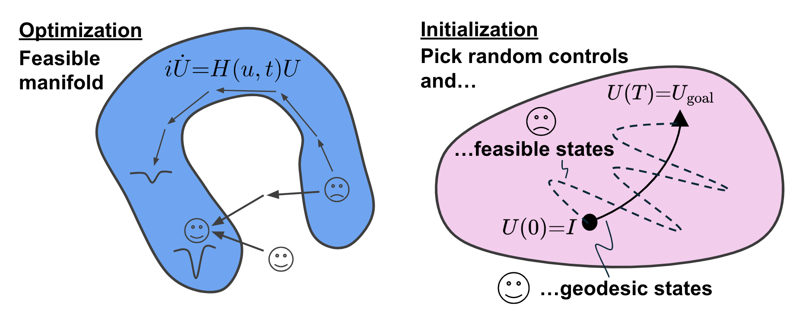

# Quantum Trajectory Optimization - Lecture 3

```@example quantumtraj
using Piccolo
using LinearAlgebra
using CairoMakie
using QuantumToolbox
using SparseArrays

const ⊗ = kron
```

## I. Rotations

### Goals
- Geodesics
- Controllability of LTI systems
- Dynamical Lie algebras and reachability

_Comparing initialization and optimization when restricted to a feasible manifold, and how warm starts are enabled by direct control._



```@example quantumtraj
U_goal = PAULIS.X
T = 40
Δt = 0.1

# U_goal = exp(-im * H_eff * T * Δt)
H_eff = im * log(U_goal / T / Δt)
```

**Exercise**
- What happens if there is a drift operator? $H(t) = \Delta \omega Z + u(t) X$.
- Bonus: What about for an _Embedded operator_?

### Controllability

- Quick check: What happens when we kick a system $x_{n+1} = A x_n + B u_n$?

$$\mathcal{C} = \begin{bmatrix}
    B & A B & A^2 B & \cdots & A^{n-1} B
\end{bmatrix}$$

- Quick check: Why did we stop at $n-1$?

**Example**
- Test on a linear system in 2D. Recall our $F = ma$ system.

```@example quantumtraj
function continuous_to_discrete(A, B, h)
    # Construct augmented matrix for matrix exponential
    augmented_matrix = [
        A B; 
        zeros(size(B, 2), size(A, 1)) zeros(size(B, 2), size(B, 2))
    ]

    # Compute matrix exponential
    exp_matrix = exp(augmented_matrix * h)

    # Extract discrete LTI system matrices
    A_h = exp_matrix[1:size(A, 1), 1:size(A, 2)]
    B_h = exp_matrix[1:size(A, 1), size(A, 2)+1:end]

    return A_h, B_h
end

# Extract discrete LTI system matrices
A_cts = [0.0 1.0; -1.0 -0.1]
B_cts = [0.0; 1.0]
h = 0.1  # Time step
A, B = continuous_to_discrete(A_cts, B_cts, h)
```

- Let's create a 2D state.
$$z = \begin{bmatrix} x \\ \dot{x} \\ y \\ \dot{y} \end{bmatrix}$$

```@example quantumtraj
Axy = I(2) ⊗ A
Bxy = [B zeros(2); zeros(2) B]

C = hcat([Axy^n * Bxy for n in 0:size(Axy, 1)-1]...)
```

```@example quantumtraj
rank(C)
```

```@example quantumtraj
Axy = I(2) ⊗ A

# Directly move the X particle only
Bxy = [[1; 0] zeros(2); [0; 1] zeros(2)]

C = hcat([Axy^n * Bxy for n in 0:size(Axy, 1)-1]...)
```

```@example quantumtraj
rank(C)
```

What about quantum systems? They are nonlinear.

- BCH
$$e^{X} e^{Y} = e^{X + Y + \tfrac{1}{2} [X, Y] + \tfrac{1}{12} ([X, [X, Y]] + [Y, [Y, X]])}$$

- Collect commutators, forming the **Dynamical Lie algebra**.

- Quick check: How can we test for linear dependence?

```@example quantumtraj
# Linearly dependent: QR decomposition has a zero on diagonal 
H_drives = [PAULIS.X, PAULIS.Y]
# H_drives = [PAULIS.X, PAULIS.X]

M = stack(vec.(H_drives))
qr(M).R
```

- Quick check: What about systems with drift?

## II. Demos

**Bloch sphere**

```@example quantumtraj
Δ = 0.2
qubit = QuantumSystem(Δ * PAULIS.Z, [PAULIS.X, PAULIS.Y])
ψ0 = ket_from_string("e+g", [2])
ψT = ket_from_bitstring("0")
T = 40
Δt = 0.1
prob = QuantumStateSmoothPulseProblem(qubit, ψ0, ψT, T, Δt)
```

```@example quantumtraj
fig, = plot_bloch(prob.trajectory)
fig
```

```@example quantumtraj
plot(prob.trajectory, :a)
```

```@example quantumtraj
solve!(prob, max_iter=30, options=IpoptOptions(eval_hessian=true))
```

```@example quantumtraj
fig, = plot_bloch(prob.trajectory)
fig
```

```@example quantumtraj
plot(prob.trajectory, :a)
```

**CZ gate**

$$H(t) = \sum_j \tfrac{\eta}{2} a_j^\dagger a_j^\dagger a_j a_j + \Delta(t) (a_1^\dagger a_1) + g(t) (a_1^\dagger a_2 + a_1 a_2^\dagger)$$

```@example quantumtraj
n_levels = 2
a = lift_operator(annihilate(n_levels), 1, 2)
b = lift_operator(annihilate(n_levels), 2, 2)
η = -0.3

H_drift = η/2 * (a'a'*a*a + b'b'*b*b)
H_drives = [a'a', (a'b + a*b')]
transmons = QuantumSystem(H_drift, H_drives)

U_goal = EmbeddedOperator(
    GATES.CZ, 
    get_subspace_indices([1:2, 1:2], [n_levels, n_levels]), 
    [n_levels, n_levels]
)
```

```@example quantumtraj
commutator(A, B) = A * B - B * A
```

```@example quantumtraj
A = H_drives[1]
B = H_drives[2]
commutator(A, B) |> sparse
```

```@example quantumtraj
try
    is_reachable(U_goal, transmons)
catch e
    println(e)
end
```

**Continuous-variable quantum computing**

$$H(t) = \Omega(t) a^\dagger + \Omega(t) a + \kappa(t) a^2 + \kappa^*(t) (a^\dagger)^2$$

```@example quantumtraj
n_levels = 5

a = annihilate(n_levels)
X = a + a'
Y = -im * (a - a')
X2 = a^2 + (a')^2
Y2 = -im * (a^2 - (a')^2)

Ω = 1.0
κ = 0.1

sys = QuantumSystem([X, Y, X2, Y2])

# Displacement and squeezing operators
function displacement(α)
    return exp(α * a' - conj(α) * a)
end

function squeezing(r)
    return exp((r / 2) * (a^2 - (a')^2))
end

# Initial states
ψ0 = I(n_levels)[:, 1] .+ 0.0im
ψα = displacement(im * 1.5) * ψ0;
ψs = squeezing(0.5) * displacement(0.5 + 0.5im) * ψ0;
```

### Coherent state

```@example quantumtraj
T = 40
Δt = 0.2
prob = QuantumStateSmoothPulseProblem(sys, ψ0, ψα, T, Δt, dda_bound=0.1)
solve!(prob, max_iter=30, options=IpoptOptions(eval_hessian=true))
```

```@example quantumtraj
rollout_fidelity(prob.trajectory, sys)
```

```@example quantumtraj
fig, = plot_wigner(prob.trajectory, 1)
fig
```

```@example quantumtraj
fig, = plot_wigner(prob.trajectory, prob.trajectory.T)
fig
```

```@example quantumtraj
fig, = plot_wigner(QuantumObject(ψα))
fig
```

```@example quantumtraj
plot(
    prob.trajectory, [:a],
    transformations = [:ψ̃ => ψ̃ -> abs2.(iso_to_ket(ψ̃)),],
    use_autolimits=true,
    transformation_titles = ["Population"],
)
```

#### Minimum Time

```@example quantumtraj
min_prob = QuantumStateMinimumTimeProblem(prob, ψα)
```

```@example quantumtraj
solve!(min_prob, max_iter=30)
```

```@example quantumtraj
fig, = plot_wigner(min_prob.trajectory, min_prob.trajectory.T)
fig
```

```@example quantumtraj
plot(
    min_prob.trajectory, [:a],
    transformations = [:ψ̃ => ψ̃ -> abs2.(iso_to_ket(ψ̃)),],
    use_autolimits=true,
    transformation_titles = ["Population"],
)
```

### Squeezed states

Further exercises and explorations with squeezed states can be implemented here.
